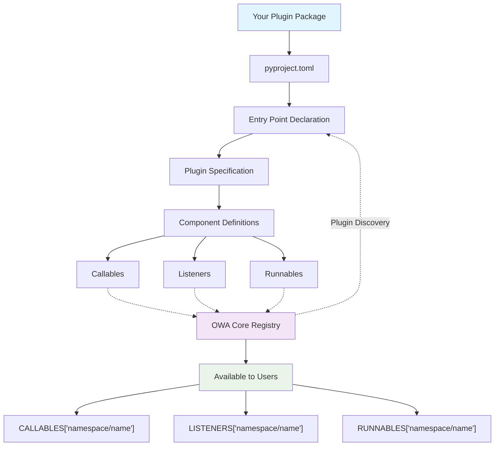

# Custom Plugin Development

Create plugins that extend OWA with your own functionality - from game automation to business integrations.

## How It Works

OWA automatically discovers plugins using Python's Entry Points system:



1. You declare an entry point in `pyproject.toml`
2. OWA scans installed packages for these entry points
3. Your components become available immediately after `pip install`

## ⚡ Quick Start: Your First Plugin in 5 Minutes

!!! tip "Follow Along"
    Open a terminal and follow these steps. You'll have a working plugin in minutes!

### Step 1: Copy the Template

```bash
# Copy the example plugin as your starting point
cp -r projects/owa-env-example my-first-plugin
cd my-first-plugin
```

The template gives you a complete, working plugin that you can modify.

### Step 2: Make It Yours

Edit `pyproject.toml` to change the plugin name:

```toml
[project.entry-points."owa.env.plugins"]
myfirst = "owa.env.plugins.myfirst:plugin_spec"  # Changed from 'example'
```

Edit `owa/env/plugins/example.py` and change the namespace:

```python
plugin_spec = PluginSpec(
    namespace="myfirst",  # Changed from 'example'
    version="0.1.0",
    description="My first OWA plugin",
    # ... rest stays the same
)
```

### Step 3: Install and Test

```bash
# Install your plugin
pip install -e .

# Verify OWA discovered it
owl env list myfirst

# Test a component
python -c "from owa.core import CALLABLES; print(CALLABLES['myfirst/add'](2, 3))"
```

!!! success "🎉 Congratulations!"
    You just created your first OWA plugin. Your components are now available to any OWA user or application.

    **What Just Happened?**

    - **Entry Point Registration**: Your `pyproject.toml` told Python about your plugin
    - **Automatic Discovery**: OWA found your plugin when it scanned entry points
    - **Component Registration**: Your functions became available as `myfirst/add`, `myfirst/print`, etc.
    - **Zero Configuration**: Users don't need to do anything - your plugin just works

## Component Types

OWA plugins provide three types of components:

### Callables: Direct Function Calls

Functions users invoke for immediate results. Perfect for screenshots, mouse clicks, file processing, calculations.

```python
def click_mouse(x: int, y: int, button: str = "left") -> bool:
    """Click mouse at coordinates."""
    from pynput import mouse
    controller = mouse.Controller()
    controller.position = (x, y)
    controller.click(getattr(mouse.Button, button))
    return True

# Usage: CALLABLES["yourplugin/click"](100, 200)
```

### Listeners: Event Monitoring

Watch for events and call user callbacks. Perfect for keyboard/mouse monitoring, file changes, system notifications.

```python
from owa.core import Listener

class KeyboardListener(Listener):
    def on_configure(self, callback, **kwargs):
        self.callback = callback

    def start(self):
        # Monitor keyboard, call self.callback(key_data) on events
        pass

    def stop(self):
        # Stop monitoring and cleanup
        pass

# Usage:
# listener = LISTENERS["yourplugin/keyboard"]
# listener.configure(callback=my_handler)
# listener.start()
```

### Runnables: Background Tasks

Long-running processes that can be started/stopped. Perfect for data collection, file processing, monitoring.

```python
from owa.core import Runnable
import time

class DataCollector(Runnable):
    def on_configure(self, output_file: str, interval: float = 1.0):
        self.output_file = output_file
        self.interval = interval

    def run(self):
        while self.running:  # OWA manages this flag
            # Do work
            with open(self.output_file, 'a') as f:
                f.write(f"Data at {time.time()}\n")
            time.sleep(self.interval)

# Usage:
# collector = RUNNABLES["yourplugin/collector"]
# collector.configure(output_file="data.txt")
# collector.start()  # Runs in background
```

## Building from Scratch

Let's create a simple "system monitor" plugin with all three component types.

### Project Setup

```bash
mkdir owa-env-sysmon && cd owa-env-sysmon
```

Create `pyproject.toml`:
```toml
[project]
name = "owa-env-sysmon"
version = "0.1.0"
dependencies = ["owa-core", "psutil"]

[project.entry-points."owa.env.plugins"]
sysmon = "sysmon_plugin:plugin_spec"
```

Create `sysmon_plugin.py`:

```python
import time
import psutil
from owa.core import Listener, Runnable
from owa.core.plugin_spec import PluginSpec

# Callables
def get_cpu_percent() -> float:
    return psutil.cpu_percent(interval=1)

def get_memory_info() -> dict:
    memory = psutil.virtual_memory()
    return {'total': memory.total, 'available': memory.available, 'percent': memory.percent}

# Listener
class ThresholdMonitor(Listener):
    def on_configure(self, callback, cpu_threshold=80.0, check_interval=5.0):
        self.callback = callback
        self.cpu_threshold = cpu_threshold
        self.check_interval = check_interval
        self.monitoring = False

    def start(self):
        self.monitoring = True
        while self.monitoring:
            cpu = psutil.cpu_percent(interval=1)
            if cpu > self.cpu_threshold:
                self.callback({'type': 'cpu_high', 'value': cpu})
            time.sleep(self.check_interval)

    def stop(self):
        self.monitoring = False

# Runnable
class SystemLogger(Runnable):
    def on_configure(self, log_file="system.log", interval=10.0):
        self.log_file = log_file
        self.interval = interval

    def run(self):
        with open(self.log_file, 'a') as f:
            while self.running:
                cpu = psutil.cpu_percent(interval=1)
                memory = psutil.virtual_memory().percent
                timestamp = time.strftime("%Y-%m-%d %H:%M:%S")
                f.write(f"{timestamp}, CPU: {cpu:.1f}%, Memory: {memory:.1f}%\n")
                f.flush()
                time.sleep(self.interval)

# Plugin specification
plugin_spec = PluginSpec(
    namespace="sysmon",
    version="0.1.0",
    description="System monitoring plugin",
    components={
        "callables": {
            "cpu": "sysmon_plugin:get_cpu_percent",
            "memory": "sysmon_plugin:get_memory_info",
        },
        "listeners": {
            "threshold": "sysmon_plugin:ThresholdMonitor",
        },
        "runnables": {
            "logger": "sysmon_plugin:SystemLogger",
        }
    }
)
```

### Install and Test

```bash
pip install -e .
owl env list sysmon

# Test components
python -c "
from owa.core import CALLABLES, LISTENERS, RUNNABLES
print('CPU:', CALLABLES['sysmon/cpu']())
print('Memory:', CALLABLES['sysmon/memory']())
"
```

## Plugin Structure Options

!!! info "Choose based on your needs"

    === "Simple/Flat"
        Everything in one file - good for prototypes:
        ```
        my-plugin/
        ├── pyproject.toml
        ├── plugin.py              # All code here
        └── tests/
        ```

        ```toml title="pyproject.toml"
        [project.entry-points."owa.env.plugins"]
        myplugin = "plugin:plugin_spec"
        ```

    === "Company/Domain"
        Integrate with existing code:
        ```
        acme-tools/
        ├── pyproject.toml
        ├── acme/tools/
        │   ├── core/
        │   └── owa_plugin.py       # Plugin spec
        └── tests/
        ```

        ```toml title="pyproject.toml"
        [project.entry-points."owa.env.plugins"]
        acme_tools = "acme.tools.owa_plugin:plugin_spec"
        ```

    === "OWA Recommended"
        Follow OWA conventions:
        ```
        owa-env-myplugin/
        ├── pyproject.toml
        ├── owa/env/
        │   ├── myplugin/           # Implementation
        │   └── plugins/myplugin.py # Plugin spec
        └── tests/
        ```

        ```toml title="pyproject.toml"
        [project.entry-points."owa.env.plugins"]
        myplugin = "owa.env.plugins.myplugin:plugin_spec"
        ```

## Testing and Validation

### Writing Tests for Your Plugin

Create `tests/test_sysmon.py`:

```python
import pytest
from sysmon_plugin import get_cpu_percent, get_memory_info, plugin_spec

def test_cpu_percent():
    """Test CPU percentage function."""
    cpu = get_cpu_percent()
    assert isinstance(cpu, float)
    assert 0 <= cpu <= 100

def test_memory_info():
    """Test memory info function."""
    memory = get_memory_info()
    assert isinstance(memory, dict)
    assert 'total' in memory
    assert 'available' in memory
    assert 'percent' in memory

def test_plugin_spec():
    """Test plugin specification is valid."""
    assert plugin_spec.namespace == "sysmon"
    assert "callables" in plugin_spec.components
    assert "cpu" in plugin_spec.components["callables"]
```

### Validation Commands

```bash
# Run your tests
python -m pytest tests/ -v

# Validate plugin specification
owl env docs --validate sysmon --strict

# Check for namespace conflicts
owl env stats --namespaces

# Test component loading
python -c "
from owa.core import CALLABLES, LISTENERS, RUNNABLES
print('Callables:', list(CALLABLES.keys()))
print('Listeners:', list(LISTENERS.keys()))
print('Runnables:', list(RUNNABLES.keys()))
"
```


## Common Patterns and Best Practices

### Naming Conventions

- **Namespace**: Short, descriptive, lowercase with underscores: `desktop`, `my_company`, `game_bot`
- **Component names**: Use dots for hierarchy: `mouse.click`, `file.read`, `ai.analyze`
- **Package name**: Follow Python conventions: `owa-env-yourplugin`

### Error Handling

Always handle errors gracefully in your components:

```python
def safe_operation(param: str) -> dict:
    """Example of proper error handling."""
    try:
        # Your operation here
        result = perform_operation(param)
        return {"success": True, "data": result}
    except ValueError as e:
        return {"success": False, "error": f"Invalid parameter: {e}"}
    except Exception as e:
        return {"success": False, "error": f"Unexpected error: {e}"}
```

### Documentation

Document your components thoroughly:

```python
def my_function(param1: int, param2: str = "default") -> bool:
    """One-line summary of what this function does.

    Longer description explaining the purpose, behavior, and any
    important details users should know.

    Args:
        param1: Description of first parameter
        param2: Description of second parameter with default

    Returns:
        Description of return value

    Raises:
        ValueError: When param1 is negative
        ConnectionError: When network operation fails

    Example:
        >>> CALLABLES["myplugin/myfunction"](42, "test")
        True
    """
    # Implementation here
```

### Performance Considerations

- **Lazy loading**: Components are loaded only when first used
- **Resource cleanup**: Always clean up in Listener/Runnable's resources with `try-finally` pattern
- **CPU usage**: Be mindful of CPU-intensive operations and busy-waiting in Listeners/Runnables
- **Memory usage**: Be mindful of memory leaks in long-running Runnables

## Troubleshooting Common Issues

!!! failure "Having problems? Check these common solutions"

    === "🔍 Plugin Not Discovered"
        **Symptoms**: `owl env list` doesn't show your plugin

        **Debug steps:**

        1. **Verify installation:**
           ```bash
           pip list | grep your-plugin-name
           ```

        2. **Check entry points:**
           ```bash
           python -c "
           try:
               from importlib.metadata import entry_points
           except ImportError:
               from importlib_metadata import entry_points

           eps = entry_points(group='owa.env.plugins')
           for ep in eps:
               print(f'{ep.name}: {ep.value}')
           "
           ```

        3. **Test plugin spec import:**
           ```bash
           python -c "from your.module.path import plugin_spec; print(plugin_spec.namespace)"
           ```

        **Common causes:**

        - Plugin not installed (`pip install -e .`)
        - Entry point name conflicts with existing plugin
        - Incorrect entry point path in `pyproject.toml`

    === "❌ Import Errors"
        **Symptoms**: Validation fails with import errors

        **Debug command:**
        ```bash
        owl env docs --validate yourplugin --output-format text
        ```

        **Common causes & solutions:**

        | Problem | Solution |
        |---------|----------|
        | Missing dependencies | Add them to `pyproject.toml` dependencies |
        | Wrong import paths | Check `module.path:object_name` format |
        | Circular imports | Keep plugin spec separate from implementation |
        | Module not found | Ensure module is importable after installation |

    === "🚫 Component Issues"
        **"Component not callable" errors:**

        ```python
        # ❌ Wrong - points to module
        "callables": {
            "bad": "mymodule.utils"
        }

        # ✅ Correct - points to function
        "callables": {
            "good": "mymodule.utils:my_function"
        }
        ```

        **Listener/Runnable doesn't work:**

        ```python
        # ✅ Correct structure
        from owa.core import Listener

        class MyListener(Listener):  # Must inherit
            def on_configure(self, callback, **kwargs):  # Must implement
                self.callback = callback
                # Your setup code
        ```

        **Common issues:**

        - Not inheriting from `owa.core.Listener` or `owa.core.Runnable`
        - Missing `on_configure()` method
        - Not calling `super().__init__()` in custom `__init__`

    === "🔧 Quick Diagnostics"
        **Run these commands to diagnose issues:**

        ```bash
        # Check if OWA can see your plugin
        owl env list yourplugin

        # Validate plugin specification
        owl env docs --validate yourplugin --strict

        # Check for namespace conflicts
        owl env stats --namespaces

        # Test component loading manually
        python -c "
        from owa.core import CALLABLES, LISTENERS, RUNNABLES
        print('Available namespaces:')
        namespaces = set()
        for key in list(CALLABLES.keys()) + list(LISTENERS.keys()) + list(RUNNABLES.keys()):
            namespaces.add(key.split('/')[0])
        for ns in sorted(namespaces):
            print(f'  - {ns}')
        "
        ```

        **Still having issues?**

        - Check the [OWA GitHub Issues](https://github.com/open-world-agents/open-world-agents/issues)
        - Look at working examples in `projects/owa-env-*`
        - Ensure you're using compatible versions of dependencies


## Publishing Your Plugin

!!! info "Distribution Options"

    === "Recommended: uv"
        **Build and publish with uv (recommended):**
        ```bash
        # Build your plugin
        uv build

        # Publish to PyPI
        uv publish
        ```

        For detailed guidance, see:

        - [uv build documentation](https://docs.astral.sh/uv/guides/publish/#building-your-package)
        - [uv publish documentation](https://docs.astral.sh/uv/guides/publish/#publishing-your-package)

    === "Local/Team Use"
        ```bash
        # Install from local directory
        pip install -e /path/to/your-plugin

        # Install from git repository
        pip install git+https://github.com/yourusername/your-plugin.git
        ```

    === "Alternative Tools"
        ```bash
        # Using build + twine
        python -m build
        python -m twine upload dist/*

        # Using poetry
        poetry build
        poetry publish
        ```

## Next Steps

- **Explore existing plugins**: Look at `projects/owa-env-*` for real examples
- **Join the community**: Share your plugins and get feedback
- **Contribute**: Consider contributing your plugin to the OWA ecosystem
