# Custom EnvPlugin Development

Create your own environment plugins using the Entry Points-based discovery system. Plugins are automatically discovered when installed, requiring zero configuration from users.

## ⚡ Quick Start (5 minutes)

!!! tip "TL;DR: Get a plugin running in 5 minutes"

    ```bash
    # 1. Copy the template
    cp -r projects/owa-env-example my-awesome-plugin
    cd my-awesome-plugin

    # 2. Edit pyproject.toml - change the entry point name
    # [project.entry-points."owa.env.plugins"]
    # awesome = "owa.env.plugins.awesome:plugin_spec"

    # 3. Edit owa/env/plugins/example.py - change namespace
    # namespace="awesome"

    # 4. Install and test
    pip install -e .
    owl env list awesome
    python -c "from owa.core import CALLABLES; print(CALLABLES['awesome/add'](2, 3))"
    ```

    **Result**: Your plugin is live! Components are automatically available across the entire OWA ecosystem.

### Visual Plugin Architecture


## What are Entry Points?

Entry Points are a standard Python packaging mechanism that allows packages to advertise components that can be discovered and loaded by other packages. They're defined in your `pyproject.toml` file and enable automatic plugin discovery.

!!! info "Entry Points Documentation"
    For detailed information about Entry Points and plugin development, see:

    - [Entry Points Specification](https://packaging.python.org/en/latest/specifications/entry-points/)
    - [Creating and Discovering Plugins](https://packaging.python.org/en/latest/guides/creating-and-discovering-plugins/)

When you install a plugin with entry points, OWA automatically discovers and registers all components without any manual configuration. This is what makes the `pip install` → immediate availability workflow possible.

!!! tip "Try the Example Plugin"
    If you want to test the example plugin that OWA provides:

    ```bash
    pip install -e projects/owa-env-example
    owl env list example
    ```

## Quick Start

=== "1. Copy Template"

    Start by copying the [owa-env-example](https://github.com/open-world-agents/open-world-agents/tree/main/projects/owa-env-example) directory as your template:

    ```bash
    cp -r owa-env-example owa-env-myplugin
    cd owa-env-myplugin
    ```

    The template contains:
    ```
    owa-env-example/
    ├── owa/env/example/          # Component implementations
    ├── owa/env/plugins/example.py # Plugin specification
    ├── pyproject.toml            # Entry point declaration
    ├── tests/                    # Test files
    └── README.md
    ```

=== "2. Entry Point"

    Update `pyproject.toml` to declare your plugin entry point:

    ```toml
    [project.entry-points."owa.env.plugins"]
    myplugin = "your.module.path:plugin_spec"
    ```

    **Examples of valid entry points:**
    ```toml
    # Recommended OWA structure
    myplugin = "owa.env.plugins.myplugin:plugin_spec"

    # Your own company structure
    myplugin = "my_company.tools.myplugin:plugin_spec"

    # Flat structure
    myplugin = "myplugin_package:plugin_spec"
    ```

=== "3. Plugin Spec"

    Create your plugin specification file. This defines what components your plugin provides:

    ```python
    """
    Plugin specification for MyPlugin.

    Keep this separate to avoid circular imports during discovery.
    """
    from owa.core.plugin_spec import PluginSpec

    plugin_spec = PluginSpec(
        namespace="myplugin",           # Unique namespace for your plugin
        version="0.1.0",
        description="My custom plugin",
        author="Your Name",             # Optional
        components={
            "callables": {
                "hello": "your.module:say_hello",
                "add": "your.module:add_numbers",
            },
            "listeners": {
                "events": "your.module:EventListener",
            },
            "runnables": {
                "processor": "your.module:DataProcessor",
            }
        }
    )
    ```

=== "4. Implement Components"

    Write your component implementations:

    ```python
    # Callable function
    def say_hello(name: str = "World") -> str:
        """Say hello to someone."""
        return f"Hello, {name}!"

    def add_numbers(a: int, b: int) -> int:
        """Add two numbers."""
        return a + b

    # Listener class
    from owa.core import Listener

    class EventListener(Listener):
        def on_configure(self, callback, **kwargs):
            # Setup event handling logic
            self.callback = callback
            # Implementation details...

    # Runnable class
    from owa.core import Runnable

    class DataProcessor(Runnable):
        def on_configure(self, **kwargs):
            # Setup background processing
            # Implementation details...
    ```

=== "5. Install & Test"

    Install your plugin in development mode and test:

    ```bash
    # Install in development mode (if you're in the plugin directory)
    pip install -e .

    # Or from project root (adjust path to your plugin)
    pip install -e path/to/your-plugin

    # Verify plugin is discovered
    owl env list myplugin

    # Test components are available
    python -c "from owa.core import CALLABLES; print(CALLABLES['myplugin/hello']())"
    ```

## 🔄 Development Workflow

### Complete Development Cycle

```mermaid
flowchart TD
    A[💡 Plugin Idea] --> B[📋 Plan Components]
    B --> C[🏗️ Choose Structure]
    C --> D[📝 Write Plugin Spec]
    D --> E[⚙️ Implement Components]
    E --> F[🧪 Write Tests]
    F --> G[📦 Install Locally]
    G --> H{✅ Validation}
    H -->|❌ Fails| I[🔧 Fix Issues]
    I --> E
    H -->|✅ Passes| J[📚 Document]
    J --> K[🚀 Publish]
    K --> L[🌍 Available to Users]

    style A fill:#fff3e0
    style H fill:#e8f5e8
    style L fill:#e3f2fd
```



### Testing & Validation Commands

```bash
# Development cycle commands
pip install -e .                           # Install in dev mode
owl env list myplugin                       # Verify discovery
owl env docs --validate myplugin --strict  # Validate plugin
python -m pytest tests/                    # Run tests

# Component testing
python -c "
from owa.core import CALLABLES
result = CALLABLES['myplugin/hello']('World')
print(f'Result: {result}')
"

# Advanced validation
owl env docs --validate --output-format json  # JSON validation report
owl env stats --namespaces                    # Check namespace conflicts
```

## PluginSpec Reference

The `PluginSpec` class is the core of your plugin definition. It tells OWA what components your plugin provides and where to find them.

### Required Fields

!!! info "PluginSpec Fields"

    === "namespace"
        **Unique identifier for your plugin**

        - Must contain only letters, numbers, underscores, and hyphens
        - Should be short and descriptive
        - Examples: `desktop`, `gst`, `mycompany_tools`

        ```python
        namespace="myplugin"  # Components will be accessible as "myplugin/component_name"
        ```

    === "version"
        **Plugin version following semantic versioning**

        - Format: `MAJOR.MINOR.PATCH`
        - Update when making changes
        - Document breaking changes in major versions

        ```python
        version="1.2.3"
        ```

    === "description"
        **Brief description of plugin functionality**

        - Should clearly explain what the plugin does
        - Used in CLI tools and documentation

        ```python
        description="Desktop automation tools for screen capture and input"
        ```

    === "components"
        **Dictionary defining all plugin components**

        - Keys are component types: `callables`, `listeners`, `runnables`
        - Values are dictionaries mapping component names to import paths
        - Import paths use format: `"module.path:object_name"`

        ```python
        components={
            "callables": {
                "hello": "your.module:say_hello",
                "math.add": "your.module.math:add_numbers"
            },
            "listeners": {
                "events": "your.module:EventListener"
            },
            "runnables": {
                "processor": "your.module:DataProcessor"
            }
        }
        ```

### Optional Fields

- **author**: Plugin author name (string)

### Complete PluginSpec Example

```python
from owa.core.plugin_spec import PluginSpec

plugin_spec = PluginSpec(
    namespace="mycompany_tools",
    version="2.1.0",
    description="Custom tools for automation and monitoring",
    author="MyCompany Development Team",
    components={
        "callables": {
            # Math utilities
            "math.add": "owa.env.mycompany_tools.math:add_numbers",
            "math.multiply": "owa.env.mycompany_tools.math:multiply_numbers",

            # File operations
            "file.read": "owa.env.mycompany_tools.files:read_file",
            "file.write": "owa.env.mycompany_tools.files:write_file",

            # System utilities
            "system.info": "owa.env.mycompany_tools.system:get_system_info",
        },
        "listeners": {
            # Event monitoring
            "file.changes": "owa.env.mycompany_tools.monitoring:FileChangeListener",
            "system.alerts": "owa.env.mycompany_tools.monitoring:SystemAlertListener",
        },
        "runnables": {
            # Background services
            "log.processor": "owa.env.mycompany_tools.services:LogProcessor",
            "health.checker": "owa.env.mycompany_tools.services:HealthChecker",
        }
    }
)
```


### YAML Format Alternative

You can also define your plugin specification in YAML format:

```yaml
namespace: mycompany_tools
version: "2.1.0"
description: "Custom tools for automation and monitoring"
author: "MyCompany Development Team"
components:
  callables:
    math.add: "owa.env.mycompany_tools.math:add_numbers"
    file.read: "owa.env.mycompany_tools.files:read_file"
  listeners:
    file.changes: "owa.env.mycompany_tools.monitoring:FileChangeListener"
  runnables:
    log.processor: "owa.env.mycompany_tools.services:LogProcessor"
```

Then load it in Python:

```python
from owa.core.plugin_spec import PluginSpec
from pathlib import Path

# Load from YAML file
plugin_spec = PluginSpec.from_yaml(Path(__file__).parent / "plugin.yaml")
```

## 🔧 Troubleshooting Guide

### Common Issues & Solutions

!!! failure "Plugin Not Discovered"

    **Symptoms**: `owl env list` doesn't show your plugin

    ```bash
    # Debug steps
    pip list | grep your-plugin-name     # Verify installation
    python -c "
    try:
        from importlib.metadata import entry_points
    except ImportError:
        from importlib_metadata import entry_points

    eps = entry_points(group='owa.env.plugins')
    for ep in eps:
        print(f'{ep.name}: {ep.value}')
    "
    ```

    **Common causes**:
    - Entry point name conflicts with existing plugin
    - Incorrect entry point path in `pyproject.toml`
    - Plugin not installed (`pip install -e .`)

!!! failure "Import Errors"

    **Symptoms**: Validation fails with import errors

    ```bash
    # Detailed validation
    owl env docs --validate myplugin --output-format text

    # Test imports manually
    python -c "
    from your.module.path import your_function
    print('Import successful!')
    "
    ```

    **Common causes**:
    - Missing dependencies in `pyproject.toml`
    - Incorrect import paths in plugin spec
    - Circular imports

!!! failure "Component Not Callable"

    **Symptoms**: `Object 'name' is not callable`

    ```python
    # ❌ Wrong - importing a module
    "components": {
        "callables": {
            "bad": "mymodule.utils"  # Points to module, not function
        }
    }

    # ✅ Correct - importing a function
    "components": {
        "callables": {
            "good": "mymodule.utils:my_function"  # Points to function
        }
    }
    ```

### Debug Plugin Discovery


## Component Types

OWA plugins can provide three types of components:

!!! tip "Component Types Overview"

    === "Callables"
        **Functions that users invoke directly**

        - Synchronous operations that return immediate results
        - Can be functions or callable classes
        - Accessed via `CALLABLES["namespace/name"](args)`

        !!! example "Real-world Callable Examples"

            === "🖱️ Mouse Control"
                ```python
                def click_mouse(x: int, y: int, button: str = "left") -> bool:
                    """Click mouse at specific coordinates.

                    Args:
                        x: X coordinate on screen
                        y: Y coordinate on screen
                        button: Mouse button ('left', 'right', 'middle')

                    Returns:
                        True if click succeeded

                    Example:
                        >>> CALLABLES["desktop/click"](100, 200, "left")
                        True
                    """
                    from pynput.mouse import Button, Listener as MouseListener
                    from pynput import mouse

                    try:
                        # Map string to pynput Button
                        button_map = {
                            "left": Button.left,
                            "right": Button.right,
                            "middle": Button.middle
                        }

                        controller = mouse.Controller()
                        controller.position = (x, y)
                        controller.click(button_map.get(button, Button.left))
                        return True
                    except Exception:
                        return False
                ```

            === "📸 Screen Capture"
                ```python
                import numpy as np
                from PIL import ImageGrab

                def capture_screen(region: tuple = None) -> np.ndarray:
                    """Capture screen or region as numpy array.

                    Args:
                        region: (left, top, right, bottom) or None for full screen

                    Returns:
                        RGB image as numpy array (height, width, 3)

                    Example:
                        >>> img = CALLABLES["desktop/capture"]()
                        >>> img.shape
                        (1080, 1920, 3)
                    """
                    screenshot = ImageGrab.grab(bbox=region)
                    return np.array(screenshot)
                ```

            === "🧮 Math Utilities"
                ```python
                def calculate_distance(point1: tuple, point2: tuple) -> float:
                    """Calculate Euclidean distance between two points.

                    Example:
                        >>> CALLABLES["math/distance"]((0, 0), (3, 4))
                        5.0
                    """
                    import math
                    return math.sqrt((point2[0] - point1[0])**2 + (point2[1] - point1[1])**2)
                ```

    === "Listeners"
        **Event-driven components that respond to system events**

        - React to external events (keyboard, mouse, file changes, etc.)
        - Run user-provided callbacks when events occur
        - Must implement `on_configure()` method

        ```python
        from owa.core import Listener

        class KeyboardListener(Listener):
            def on_configure(self, callback, **kwargs):
                """Configure the listener with user callback."""
                self.callback = callback
                # Setup keyboard event monitoring

            def start(self):
                """Start listening for events."""
                # Begin event monitoring

            def stop(self):
                """Stop listening for events."""
                # Cleanup and stop monitoring
        ```

    === "Runnables"
        **Background tasks that can be started and stopped**

        - Long-running background processes
        - Can be started, stopped, and monitored
        - Must implement `on_configure()` method

        ```python
        from owa.core import Runnable

        class DataCollector(Runnable):
            def on_configure(self, output_file: str, interval: float = 1.0):
                """Configure the runnable with parameters."""
                self.output_file = output_file
                self.interval = interval

            def run(self):
                """Main background task logic."""
                while self.running:
                    # Collect and save data
                    time.sleep(self.interval)
        ```

## Package Structure Examples

You have complete freedom in organizing your plugin code. Here are common patterns with visual examples:

### 🏗️ Structure Patterns Comparison

=== "🎯 Recommended: OWA Structure"

    **Best for**: Official plugins, following OWA conventions

    ```
    my-owa-plugin/
    ├── 📄 pyproject.toml
    ├── 📁 owa/env/
    │   ├── 📁 myplugin/           # Implementation
    │   │   ├── __init__.py
    │   │   ├── callables.py       # Functions
    │   │   ├── listeners.py       # Event handlers
    │   │   └── runnables.py       # Background tasks
    │   └── 📁 plugins/
    │       └── myplugin.py        # 🔌 Plugin spec
    ├── 📁 tests/
    └── 📄 README.md
    ```

    ```toml title="pyproject.toml"
    [project.entry-points."owa.env.plugins"]
    myplugin = "owa.env.plugins.myplugin:plugin_spec"
    ```

=== "🏢 Company Structure"

    **Best for**: Enterprise plugins, company-specific tools

    ```
    acme-automation-tools/
    ├── 📄 pyproject.toml
    ├── 📁 acme/
    │   └── 📁 automation/
    │       ├── 📁 core/           # Business logic
    │       │   ├── __init__.py
    │       │   ├── processors.py
    │       │   └── monitors.py
    │       ├── 📁 integrations/   # External APIs
    │       │   ├── salesforce.py
    │       │   └── slack.py
    │       └── owa_plugin.py      # 🔌 Plugin spec
    ├── 📁 tests/
    └── 📄 README.md
    ```

    ```toml title="pyproject.toml"
    [project.entry-points."owa.env.plugins"]
    acme_automation = "acme.automation.owa_plugin:plugin_spec"
    ```

=== "🎮 Gaming/Domain Structure"

    **Best for**: Specialized domains, gaming, specific use cases

    ```
    minecraft-automation/
    ├── 📄 pyproject.toml
    ├── 📁 minecraft_bot/
    │   ├── __init__.py            # 🔌 Plugin spec here
    │   ├── 📁 actions/            # Game actions
    │   │   ├── movement.py
    │   │   ├── inventory.py
    │   │   └── combat.py
    │   ├── 📁 sensors/            # Game state detection
    │   │   ├── screen_reader.py
    │   │   └── audio_listener.py
    │   └── 📁 ai/                 # Decision making
    │       ├── pathfinding.py
    │       └── strategy.py
    ├── 📁 assets/                 # Game assets
    └── 📄 README.md
    ```

    ```toml title="pyproject.toml"
    [project.entry-points."owa.env.plugins"]
    minecraft = "minecraft_bot:plugin_spec"
    ```

=== "⚡ Simple/Flat Structure"

    **Best for**: Small plugins, prototypes, single-purpose tools

    ```
    quick-tools/
    ├── 📄 pyproject.toml
    ├── 📄 quick_tools.py          # Everything in one file
    │   # Contains: plugin_spec + all implementations
    ├── 📁 tests/
    └── 📄 README.md
    ```

    ```toml title="pyproject.toml"
    [project.entry-points."owa.env.plugins"]
    quicktools = "quick_tools:plugin_spec"
    ```

## Plugin Validation

Use the CLI to validate your plugin during development:

```bash
# Validate plugin specification (adjust path to match your structure)
owl env validate owa.env.plugins.myplugin:plugin_spec        # OWA structure
owl env validate my_company.tools.plugin_spec:plugin_spec   # Company structure
owl env validate myplugin_package:plugin_spec               # Flat structure

# Example with the example plugin
$ owl env validate owa.env.plugins.example:plugin_spec
✅ Plugin Specification Valid
├── Source: Entry point: owa.env.plugins.example:plugin_spec
├── 📋 Plugin Metadata
│   ├── ├── Namespace: example
│   ├── ├── Version: 0.1.0
│   ├── ├── Author: OWA Development Team
│   └── └── Description: Example environment plugin demonstrating the plugin system
└── 🔧 Components Summary
    ├── ├── Total Components: 6
    ├── ├── 📞 Callables: 2
    ├── ├── 👂 Listeners: 2
    └── └── 🏃 Runnables: 2

✅ Validation successful!

# Validate with detailed output
owl env validate your.module.path:plugin_spec --verbose

# Validate YAML specification (if using YAML format)
owl env validate ./plugin.yaml
```

## CLI Tools for Development

The `owl env` command provides comprehensive tools for plugin development:

!!! tip "Essential Commands"

    ```bash
    # Discovery and listing
    owl env list myplugin                          # List your plugin components (auto-shows details)
    owl env namespaces                             # See all available namespaces

    # Example with the example plugin
    $ owl env list example
    📦 Plugin: example (6 components)
    ├── 📞 Callables: 2
    ├── 👂 Listeners: 2
    └── 🏃 Runnables: 2
    📞 Callables (2)
    ├── example/add
    └── example/print
    👂 Listeners (2)
    ├── example/listener
    └── example/timer
    🏃 Runnables (2)
    ├── example/counter
    └── example/runnable

    # Component inspection
    owl env list myplugin --inspect my_function    # Inspect specific component
    owl env list myplugin --search my_function     # Search within your plugin

    # Ecosystem analysis
    owl env stats --by-namespace                   # Statistics by namespace
    owl env stats --namespaces                     # Show available namespaces
    ```

!!! info "Complete CLI Reference"
    For detailed information about all CLI commands and options:

    - **[CLI Tools](../cli/index.md)** - Complete command overview
    - **[Environment Commands](../cli/env.md)** - Detailed `owl env` documentation

## Publishing Your Plugin

Once your plugin is ready, you can use any Python packaging tool to build and publish it. OWA doesn't impose any restrictions on build backends or publishing methods.

**Recommended approach using uv:**

```bash
# Build your plugin
uv build

# Publish to PyPI
uv publish
```

**Alternative approaches:**

```bash
# Using build + twine
python -m build
python -m twine upload dist/*

# Using poetry
poetry build
poetry publish

# Using setuptools directly
python setup.py sdist bdist_wheel
twine upload dist/*
```

For detailed information on the recommended approach, see:

- [uv build documentation](https://docs.astral.sh/uv/guides/publish/#building-your-package)
- [uv publish documentation](https://docs.astral.sh/uv/guides/publish/#publishing-your-package)

Users can then install your plugin and components are automatically available:

```bash
pip install your-plugin-name
```

```python
from owa.core import CALLABLES
result = CALLABLES["myplugin/hello"]("World")
```


