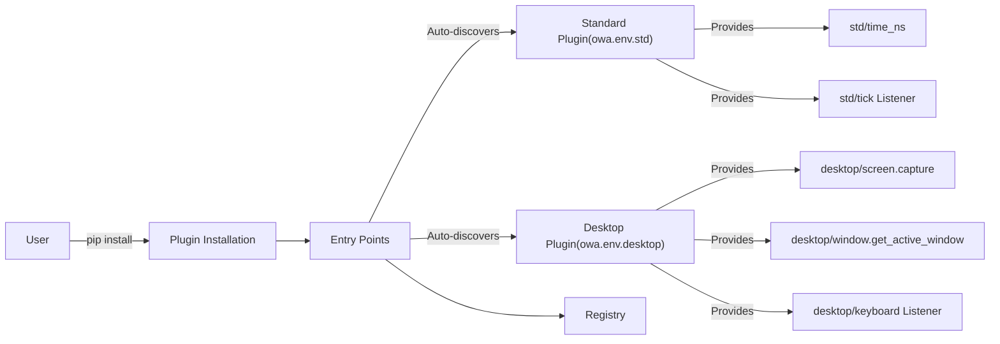

# Comprehensive Guide for Env

## Core Concepts

### Three Main Components:

Open World Agents (OWA)'s **Env** consists of three primary components that enable interaction with the environment in different ways.

1. **Callable** - Functions you actively call to perform actions or get state
    - *These are like traditional function calls; you invoke them when you need to perform an action or retrieve some information from the environment.*
    - Implements `__call__` function
    - Example: `CALLABLES["std/time_ns"]()`

2. **Listener** - Components that respond to events and execute your callbacks
    - *Listeners wait for specific events and execute your callback functions when those events occur.*
    - Takes a `callback` parameter in the `configure` method
    - Example:
```python
listener = LISTENERS["keyboard"]().configure(callback=my_callback)
with listener.session:
    input("Type enter to exit.")
```
*This example sets up a keyboard listener that invokes `my_callback` whenever a keyboard event is detected.*

3. **Runnable** - Background processes that can be started and stopped
    - *Runnables run in the background and can be managed with start and stop operations.*
    - Parent class of `Listener`, the only difference is absence of `callback` argument in `configure`.
    - Supports `start()`, `stop()`, and `join()` operations

!!! callable vs listener "What's the difference between **Callable** and **Listener**?"
    The key difference between these two is who initiates the call:

    - In **Callable**, **caller** actively executes the Callable.
    - In **Listener**, **callee** waits for events and then calls user-provided "callbacks".

    *In other words, Callables are synchronous functions you call directly, while Listeners are asynchronous and react to events.*

    Common environmental interfaces such as [gymnasium.Env](https://gymnasium.farama.org/api/env/) only provides object/method equivalent to **Callable**.

### Registry System

*The OWA environment uses a registry system to manage and access the various components.*

Components are managed through global registries:

- `CALLABLES` - Dictionary of callable functions

- `LISTENERS` - Dictionary of event listeners

- `RUNNABLES` - Dictionary of background processes

**Zero-Configuration Plugin Discovery**: Plugins are automatically discovered when installed via pip using Python's Entry Points system. No manual activation needed!

```python
from owa.core.registry import CALLABLES, LISTENERS, RUNNABLES
# Components automatically available after plugin installation
```

*All components use unified `namespace/name` naming pattern for consistency.*

## Environment Usage Examples

### Standard Environment (`owa.env.std`)

*Here is an example of how to use the standard environment to interact with clock functionalities.*

```python
import time
from owa.core.registry import CALLABLES, LISTENERS

# Components automatically available - no activation needed!
# Unified namespace/name pattern: std/time_ns, std/tick

# Testing the std/tick listener
tick = LISTENERS["std/tick"]().configure(callback=lambda: print(CALLABLES["std/time_ns"]()), interval=1)
tick.start()

time.sleep(2)  # The listener prints the current time in nanoseconds a few times

tick.stop(), tick.join()
```
*Components are automatically discovered and available after installation. All components use the unified `namespace/name` pattern.*


Instead of manual `start-stop-join` procedure, you may utilize context manager: `.session`! Following example shows how to abbreviate `start-stop-join` steps.

```python
with tick.session:
    time.sleep(2)
```

### Desktop Environment (`owa.env.desktop`)

*The desktop environment module provides capabilities for UI interaction and input handling.*

```python
from owa.core.registry import CALLABLES, LISTENERS
from owa.env.desktop.msg import KeyboardEvent

# Components automatically available - unified namespace/name pattern

# Using screen capture and window management features
print(f"{CALLABLES['desktop/screen.capture']().shape=}")  # Example output: (1080, 1920, 3)
print(f"{CALLABLES['desktop/window.get_active_window']()=}")
print(f"{CALLABLES['desktop/window.get_window_by_title']('open-world-agents')=}")

# Simulating a mouse click (left button, double click)
mouse_click = CALLABLES["desktop/mouse.click"]
mouse_click("left", 2)


# Configuring a keyboard listener
def on_keyboard_event(keyboard_event: KeyboardEvent):
    print(f"Keyboard event: {keyboard_event.event_type=}, {keyboard_event.vk=}")


keyboard_listener = LISTENERS["desktop/keyboard"]().configure(callback=on_keyboard_event)
with keyboard_listener.session:
    input("Type enter to exit.\n")
```
*Components are automatically available with unified naming. This code demonstrates capturing the screen, retrieving window information, simulating mouse clicks, and listening to keyboard events.*

### Custom EnvPlugin Example

You can create your own plugins using Entry Points for automatic discovery. For more information, see [Custom EnvPlugin](custom_plugins.md).

*Creating custom plugins allows you to extend the OWA environment with your own functionalities.*

```python
# In your plugin's pyproject.toml:
# [project.entry-points."owa.env.plugins"]
# myplugin = "owa.env.myplugin:plugin_spec"

# In your plugin specification:
from owa.core.plugin_spec import PluginSpec

plugin_spec = PluginSpec(
    namespace="myplugin",
    version="0.1.0",
    description="My custom plugin",
    components={
        "callables": {
            "add": "owa.env.myplugin:add_function",
        },
        "listeners": {
            "events": "owa.env.myplugin:EventListener",
        }
    }
)

# Using the custom plugin (automatically available after pip install)
from owa.core.registry import CALLABLES, LISTENERS
result = CALLABLES["myplugin/add"](5, 3)  # Returns 8
```
*Plugins use Entry Points for automatic discovery and unified `namespace/name` pattern for all components.*

## Architecture Summary

*The diagram below summarizes the architecture of the OWA environment and how components are registered and used.*



## CLI Tools for Plugin Management

The `owl env` command provides powerful tools for managing and exploring plugins:

### Plugin Discovery and Listing

```bash
# List all discovered plugins
$ owl env list

# List plugins in specific namespace
$ owl env list --namespace example

# List specific component types
$ owl env list --component-type callables
$ owl env list --component-type listeners
$ owl env list --component-type runnables
```

### Plugin Information

```bash
# Show plugin summary
$ owl env show example

# Show detailed component information
$ owl env show example --components
```

### Plugin Development

```bash
# Validate plugin specifications
$ owl env validate ./plugin.yaml
```

### Example CLI Output

```bash
$ owl env list
📦 Discovered Plugins
├── ├── desktop
│   ├── ├── Callables: 20
│   └── ├── Listeners: 5
├── ├── example
│   ├── ├── Callables: 3
│   ├── ├── Listeners: 2
│   └── └── Runnables: 2
└── ├── std
    ├── ├── Callables: 1
    └── ├── Listeners: 1

$ owl env show example --components
📦 Plugin: example
├── ├── Callables: 3
├── ├── Listeners: 2
└── └── Runnables: 2
🔧 Callables
├── ├── example/callable
├── ├── example/print
└── ├── example/add
```

## Additional Resources

- For standard module details: [owa-env-std](plugins/std.md)
- For desktop features: [owa-env-desktop](plugins/desktop_env.md)
- For multimedia support: [owa-env-gst](plugins/gstreamer_env.md)
- For custom EnvPlugin development: [custom_plugins.md](custom_plugins.md)