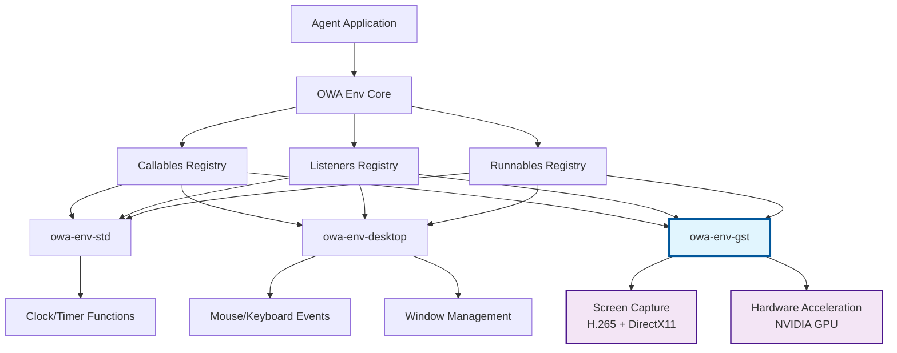
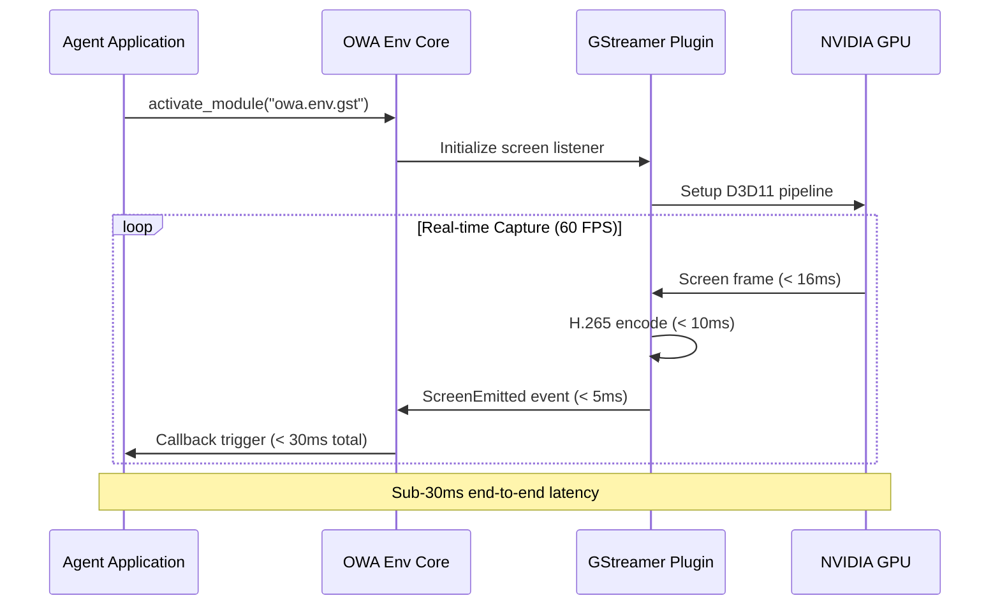

  

# Introducing OWA's Env

**Open World Agents (OWA)** introduces **Env**, a groundbreaking modular agent system designed for dynamic, real-time environments. Say goodbye to rigid frameworks with fixed interfaces—Env's flexible architecture lets you activate and customize components on the fly.

## 🏗️ Architecture Overview

## Why Choose OWA's Env?

Traditional environmental interfaces like [gymnasium.Env](https://gymnasium.farama.org/api/env/) fall short when it comes to building **real-time, real-world agents**. They rely on synchronous steps (`env.step()`, `env.reset()`), which assume your agent has infinite time to process actions. That's not realistic for agents that need to react instantly in dynamic environments.

**Env** changes the game with an event-driven, asynchronous design that mirrors real-world interactions. Here's what sets it apart:

- **Asynchronous Event Processing**: Leverage `Callables`, `Listeners`, and `Runnables` for real-time interaction. No more waiting for `env.step()`—the world doesn't stop, and neither should your agent.
- **Dynamic EnvPlugin Activation**: Seamlessly register and activate `EnvPlugins` at runtime to extend functionality, powered by registry pattern. [Learn how to create custom plugins.](custom_plugins.md)
- **Extensible, Open-Source Design**: Built for the community, by the community. Easily add custom plugins and extend the Env's functionality to suit your needs.

## ⚡ Performance Architecture

## The Future is Real-Time

Time waits for no one—and neither do real-world agents. As we advance towards more responsive AI, agents must be capable of instantaneous reactions, just like humans. Env's architecture enables:

- **True Concurrent Processing**: Handle multiple events simultaneously without bottlenecks.

- **Measured Reaction Times**: Agents operate within realistic timeframes, ensuring timely responses in dynamic settings.

- **Hardware-Accelerated Performance**: Leverage modern GPU capabilities for H.265 encoding and DirectX 11 acceleration.

We prioritize minimizing latency within the framework, aiming for agent reaction times that match or surpass human capabilities. Throughout our codebase, we ensure latency doesn't exceed **30ms**. Check out how we achieve this in our [Screen Listeners](https://github.com/open-world-agents/open-world-agents/blob/main/projects/owa-env-gst/owa/env/gst/screen/listeners.py#L88), and [Test Screen Listener](https://github.com/open-world-agents/open-world-agents/blob/main/projects/owa-env-gst/tests/test_screen_listener.py#L31).

## 🔧 Technical Implementation

The Env system leverages three core abstractions:

| Component     | Purpose                       | Examples                              |
| ------------- | ----------------------------- | ------------------------------------- |
| **Callables** | Synchronous function calls    | `clock.time_ns()`, `mouse.position()` |
| **Listeners** | Asynchronous event handlers   | Screen capture, keyboard monitoring   |
| **Runnables** | Stateful background processes | Continuous recording, data streaming  |

### Registry Pattern Benefits

- **Runtime Flexibility**: Activate only needed plugins
- **Memory Efficiency**: Load components on-demand
- **Extensibility**: Easy third-party plugin integration
- **Testing**: Mock components for unit testing

## Get Started Today

Don't let outdated frameworks hold you back. Embrace the future with OWA's Env and build agents that are ready for the real world.

[Learn more about OWA's Env Design.](guide.md)
