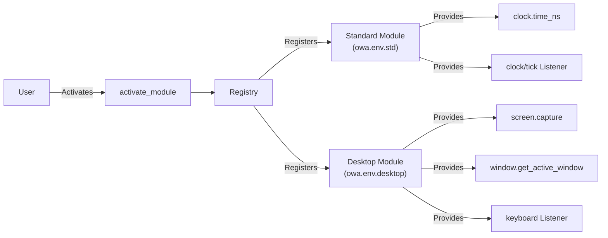

# OWA Env - Detailed Overview

This document provides a comprehensive explanation of the core functionalities and underlying logic of the Open World Agents codebase. Open World Agents is a modular agent system, where a variety of modules are dynamically registered and utilized at runtime. Below, you will find an in-depth description of the core logic, sample code, and a range of additional example projects.

## 1. Introduction

Open World Agents leverages a registration pattern that allows multiple modules to be dynamically activated during runtime. Each module's functionalities are registered in a global registry using dedicated dictionaries: CALLABLES for synchronous functions and LISTENERS for asynchronous/event-driven listeners.

## 2. Core Architecture and Registry Pattern

- **Registry:**
    - **CALLABLES:** Stores module-provided functionalities as key-value pairs (e.g., registered as `clock.time_ns`). What developer must implement is just `__call__` function.
    - **LISTENERS:** Manages classes responsible for event handling by storing them under designated keys (e.g., registered as `clock/tick`). This class takes `callback` as argument in `configure` and otherwise it's same as `Runnables`.
    - **RUNNABLES:** This is parent class of `Listeners` and it supports `start/stop/join` operations in user side and developer must implement `loop/cleanup` methods.

Modules are activated via the `activate_module` function, during which their functions and listeners are systematically added to the global registry.

## 3. Detailed Explanation of Core Logic

### 3.1. Standard Environment (owa.env.std)

The `projects/core/main.py` file initiates the standard environment. In the following example:

```python
import time
from owa.registry import CALLABLES, LISTENERS, activate_module

# Initial registry state (empty)
print(CALLABLES, LISTENERS)  # {}, {}

# Activate the standard module to register clock functionalities
activate_module("owa.env.std")
print(CALLABLES, LISTENERS)
# Example: 'clock.time_ns' is registered in CALLABLES and 'clock/tick' in LISTENERS

# Testing the clock/tick listener
tick = LISTENERS["clock/tick"]().configure(callback=lambda: print(CALLABLES["clock.time_ns"]()), interval=1)
tick.start()

time.sleep(1)  # The listener prints the current time in nanoseconds a few times

tick.stop()
tick.join()
```

This code demonstrates how activating the standard module registers clock-related functions and listeners, enabling real-time time display.

### 3.2. Desktop Environment (owa.env.desktop)

After the standard module, the desktop module is activated. This module provides user interface and input-related features. For example:

```python
# Activate the desktop module to enable UI and input capabilities
activate_module("owa.env.desktop")

# Using screen capture and window management features
print(CALLABLES["screen.capture"]().shape)  # Example output: (1080, 1920, 3)
print(CALLABLES["window.get_active_window"])()
print(CALLABLES["window.get_window_by_title"]("open-world-agents"))

# Simulating a mouse click (left button, double click)
mouse_click = CALLABLES["mouse.click"]
mouse_click("left", 2)

# Configuring a keyboard listener

def on_keyboard_event(event_type, key):
    print(f"Keyboard event: {event_type}, {key}")

keyboard_listener = LISTENERS["keyboard"]().configure(callback=on_keyboard_event)
keyboard_listener.startt()

time.sleep(5)
keyboard_listener.stop(), keyboard_listener.join()
```

This snippet illustrates functionalities such as capturing the screen, managing windows, handling mouse clicks, and responding to keyboard events.

### 3.3. Custom Extensions

The framework also supports custom modules. For instance, a module that integrates with Minecraft can be activated and used as shown below:

```python
# Example of a custom module integration with Minecraft
activate_module("owa_minecraft")
inventory = CALLABLES["minecraft.get_inventory"](player="Steve")
```

This flexibility allows developers to extend system capabilities without altering the core codebase.

## 4. Advanced Features and Extension Points

- **Modularity:** New modules can be seamlessly added, registered, and activated without modifying existing code.
- **Dynamic Activation:** The `activate_module` function allows modules to be enabled at runtime, enhancing system extensibility and flexibility.
- **Event-Driven Design:** Listeners handle asynchronous events, enabling real-time responses to external inputs.

## 5. Architecture Diagram

Below is a diagram illustrating the relationships between core components:



## 6. Overview of Additional Example Projects

Within the `/projects` directory, besides the core module, several example projects are available:

- [`owa.env.std`](plugins/std.md)
- [`owa-env-desktop`](plugins/desktop_env.md)
- [`owa-env-gst`](plugins/gstreamer_env.md)