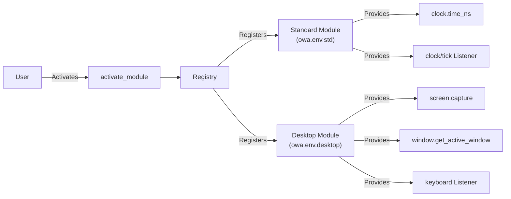

# Open World Agents - Detailed Overview

이 문서는 코드베이스의 핵심 기능과 로직을 자세하게 설명합니다. Open World Agents는 modular agent 시스템으로, 다양한 모듈들이 동적으로 등록되고 활용되는 구조를 가지고 있습니다. 아래에서는 core 로직, 예제 코드, 그리고 추가 예제 프로젝트들에 대한 상세 설명을 제공합니다.

## 1. Introduction

Open World Agents는 register 패턴을 활용하여, 여러 모듈이 런타임에 동적으로 활성화되고, 그 기능들이 전역 registry에 등록됩니다. 이 시스템은 전역 딕셔너리인 CALLABLES와 LISTENERS를 사용하여 동기 함수와 비동기/이벤트 기반 리스너들을 관리합니다.

## 2. Core Architecture and Registry Pattern

- **Registry (CALLABLES & LISTENERS):**
  - CALLABLES: 모듈이 제공하는 기능(함수)을 key-value 쌍으로 저장합니다. 예를 들어, `clock.time_ns`와 같이 등록됩니다.
  - LISTENERS: 이벤트를 처리하는 리스너 클래스들을 key로 저장합니다. 예를 들어, `clock/tick`과 같이 등록됩니다.

모듈은 `activate_module` 함수를 호출하여 활성화되며, 이 과정에서 해당 모듈의 함수와 리스너들이 registry에 등록됩니다.

## 3. Detailed Explanation of Core Logic

### 3.1. Standard Environment (owa.env.std)

프로젝트의 `projects/core/main.py` 파일에서는 초기로 표준 환경 모듈이 활성화됩니다. 아래 예제 코드는 이를 보여줍니다:

```python
import time

from owa.registry import CALLABLES, LISTENERS, activate_module

# 초기 registry 상태 출력 (비어있음)
print(CALLABLES, LISTENERS)  # {}, {}

# 표준 모듈 활성화 (clock 기능 등록)
activate_module("owa.env.std")
print(CALLABLES, LISTENERS)
# 예시: CALLABLES에 'clock.time_ns' 등록, LISTENERS에 'clock/tick' 등록

# clock/tick listener 테스트
tick = LISTENERS["clock/tick"]()
tick.configure(callback=lambda: print(CALLABLES["clock.time_ns"]()), interval=1)
tick.activate()

time.sleep(1)  # Listener가 1~2회 현재 시간을 nanosecond 단위로 출력

tick.deactivate()
tick.shutdown()
```

위 코드는 `activate_module("owa.env.std")`가 호출됨으로써 clock 관련 기능들이 Registry에 등록되고, 이를 이용해 실시간으로 시간을 출력하는 listener를 생성, 활성화, 종료하는 과정을 보여줍니다.

### 3.2. Desktop Environment (owa.env.desktop)

표준 환경 다음으로, 데스크탑 관련 모듈이 활성화됩니다:

```python
# 데스크탑 모듈 활성화 (UI 및 입력 관련 기능 제공)
activate_module("owa.env.desktop")

# 화면 캡쳐 및 창 관리 기능 사용 예시
print(CALLABLES["screen.capture"]().shape)  # 예: (1080, 1920, 3)
print(CALLABLES["window.get_active_window"]())
print(CALLABLES["window.get_window_by_title"]("open-world-agents"))

# 마우스 클릭 이벤트 (왼쪽 버튼, 2회 클릭)
mouse_click = CALLABLES["mouse.click"]
mouse_click("left", 2)

# Keyboard listener 설정 예시

def on_keyboard_event(event_type, key):
    print(f"Keyboard event: {event_type}, {key}")

keyboard_listener = LISTENERS["keyboard"]()
keyboard_listener.configure(on_keyboard_event)
keyboard_listener.activate()

time.sleep(5)
```

이 예제는 데스크탑 모듈이 제공하는 화면 캡쳐, 창 관리, 마우스 클릭, 그리고 키보드 이벤트 처리 기능을 보여줍니다.

### 3.3. Custom Extensions

시스템은 사용자 정의 모듈 확장을 적극 장려합니다. 예를 들어, Minecraft와 연동하는 모듈을 활성화하고 사용할 수 있습니다:

```python
# Custom module 예시: Minecraft 연동
activate_module("owa_minecraft")
inventory = CALLABLES["minecraft.get_inventory"](player="Steve")
```

개발자는 이와 같이 자신의 도메인에 맞는 모듈을 추가하여 시스템의 기능을 확장할 수 있습니다.

## 4. Advanced Features and Extension Points

- **Modularity:** 새로운 모듈은 기존 코드를 수정하지 않고도 추가, 등록 및 활성화가 가능합니다.
- **Dynamic Activation:** `activate_module` 함수는 런타임 중에도 모듈을 활성화할 수 있어 시스템의 확장성과 유연성을 제공합니다.
- **Event-Driven Design:** 각 리스너는 비동기 이벤트 처리를 통해 외부 입력에 실시간으로 반응합니다.

## 5. Architecture Diagram

아래 diagram은 핵심 구성 요소들 간의 관계를 나타냅니다 (모든 텍스트는 영어로 작성됨):



## 6. Overview of Additional Example Projects

`/projects` 디렉토리 내에는 core 이외에도 다양한 예제 프로젝트가 존재합니다:

- **data_collection:** 데이터 수집 및 처리 에이전트 예제들이 포함되어 있습니다.
- **minecraft_env:** Minecraft와 연동하여 게임 내부 데이터를 처리하거나 조작하는 예제 프로젝트입니다.
- **core:** 메인 로직과 핵심 모듈들이 구현되어 있으며, 위에서 설명한 기능들이 이곳에 포함되어 있습니다.

이 예제들은 시스템의 확장성, 모듈성, 그리고 다양한 응용 사례를 잘 보여줍니다.

## 7. How to Contribute

1. 리포지토리를 Fork하고 새로운 feature 브랜치를 생성하세요.
2. 코드 가이드라인에 맞춰 변경 사항을 커밋하세요. (예: 새로운 모듈 추가, 기존 모듈 개선 등)
3. 변경 내용을 코드와 문서에 모두 반영하세요.
4. Pull Request를 통해 리뷰를 요청하세요.
5. 커뮤니티 토론에 참여하여 피드백을 반영하세요.

## 8. License

This project is released under the MIT License. 모든 기여자들은 프로젝트의 가이드라인을 준수해 주시기 바랍니다.

---

## 9. In-Depth Core Logic Analysis

`projects/core/main.py` 파일에서 보여주는 예제는 다음과 같은 핵심 흐름을 가지고 있습니다:

- **초기 상태:** 프로그램 시작 시, CALLABLES와 LISTENERS는 빈 상태입니다.
- **표준 모듈 활성화:** `activate_module("owa.env.std")` 호출로 clock 관련 기능이 등록되어, 현재 시간을 nanosecond 단위로 반환하는 `clock.time_ns`와 주기적 이벤트를 발생시키는 `clock/tick` listener가 등록됩니다.
- **리스너 활용:** 등록된 `clock/tick` listener는 callback 함수를 통해 `clock.time_ns()`를 호출, 현재 시간을 출력합니다. listener의 활성화와 비활성화 및 종료 과정을 통해 시스템의 이벤트 처리 흐름을 체험할 수 있습니다.
- **데스크탑 기능:** 이후, `activate_module("owa.env.desktop")`를 호출하면 화면 캡쳐, 창 관리, 마우스/키보드 이벤트 처리 기능 등이 등록되어 실제 데스크탑 환경과 상호작용할 수 있습니다.
- **확장성:** 커스텀 모듈(`owa_minecraft` 등)을 통해, 필요에 따라 새로운 기능을 쉽게 추가할 수 있는 구조입니다.

이러한 흐름은 시스템이 동적으로 기능을 확장하고, 모듈 간의 의존성을 관리하는 방식을 명확히 보여줍니다.

## 10. Dependencies and Environment

- **Python Version:** 이 프로젝트는 Python 3.11 이상을 요구합니다.
- **Platform-Specific Dependencies:**
  - Windows: `pygetwindow`
  - macOS: `pyobjc-framework-Quartz`, `pyobjc-framework-ApplicationServices`
- **Common Dependencies:**
  - `pynput` (키보드 및 마우스 이벤트 처리)
  - `opencv-python` 및 `bettercam` (화면 캡쳐 및 이미지 처리)
  - `loguru` (로깅)
  - `pydantic` (데이터 검증 및 관리)

프로젝트 설정은 `pyproject.toml` 파일에 명시되어 있으며, 적절한 가상 환경 설정 (예: UV_PROJECT_ENVIRONMENT 환경변수를 절대경로로 지정)이 필요합니다.

---

## 11. Testing and Quality Assurance

The core functionalities and modules of Open World Agents are maintained by a comprehensive suite of tests located in the `projects/core/tests` directory. These tests ensure:

- Correct registration and deregistration of module functionalities in CALLABLES and LISTENERS.
- Proper initialization of modules via `activate_module`.
- Accurate event handling and callback execution for various listeners (e.g., `clock/tick`, `keyboard`).
- Compliance with platform-specific behaviors (e.g., screen capture and window management on macOS and Windows).

By maintaining a robust testing framework, we ensure the stability, reliability, and extensibility of the system. Contributors are encouraged to add or update tests when making significant changes or additions to the project.

## 12. Conclusion

Open World Agents is designed to be a flexible, extensible, and robust framework for developing agent-based solutions with dynamic module loading and real-time event processing. We welcome contributions and discussions from the open-source community to help us improve and expand the project.

Happy coding and 함께 혁신을 만들어 갑시다!
