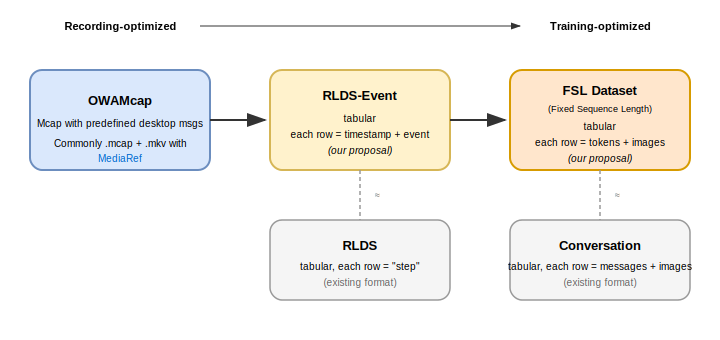

# OWA Data Pipeline

Pipeline for converting recording-optimized [OWAMcap](https://open-world-agents.github.io/open-world-agents/data/getting-started/why-owamcap/) files into training-optimized HuggingFace Datasets.

## Why?

Existing data formats are optimized for either **recording** or **training**, but not both:

- **Recording-oriented** (rosbag, mcap): Great for capture, but not directly usable for ML training
- **Training-oriented** (TFDS, RLDS, LeRobot): Great for training, but impractical for recording raw sensor streams

Optimizing for both simultaneously is fundamentally impossible. Our solution: **define multiple formats along the recording→training spectrum and convert progressively**.



**Our pipeline**: OWAMcap → RLDS-Event → FSL Dataset

- **RLDS-Event**: Similar to RLDS, but each row is an event (with nanosecond timestamp) rather than a step. No information loss from binning/grouping.
- **FSL Dataset** (Fixed Sequence Length): Episode-aware sequence packing with pre-tokenization. Adjacent events within an episode are concatenated into fixed-length token sequences, then tokenized ahead of time for zero runtime overhead.

### Feature Comparison

| Feature                   | Our Pipeline | RLDS | LeRobotDataset |
| ------------------------- | :----------: | :--: | :------------: |
| Episode-aware packing     |      ✓       |  ✗   |       ✗        |
| Video encoding            |      ✓       |  ✗   |       ✓        |
| Multi-rate sensor support |      ✓       |  ✗   |       ✗        |
| Discrete event support    |      ✓       |  ✗   |       ✗        |

_Our Pipeline = OWAMcap → RLDS-Event → FSL Dataset_

**Notes:**

- **Episode-aware packing**: Sequence packing is a well-established technique ([NVIDIA NeMo](https://docs.nvidia.com/nemo-framework/user-guide/latest/sft_peft/packed_sequence.html), [HuggingFace TRL](https://huggingface.co/docs/trl/reducing_memory_usage#packing)) that eliminates padding waste—NeMo reports up to **10x FLOPs improvement** and **6x training time reduction**. Standard packing concatenates unrelated samples; we make it **episode-aware** by concatenating **temporally adjacent events within the same episode**. This preserves sequential context, enabling models to learn from history (e.g., previous frames, prior actions).
- **Video encoding**: OWAMcap uses [MediaRef](https://github.com/open-world-agents/mediaref) to reference video-encoded frames without re-encoding.
- **Multi-rate sensor / Discrete event support**: Other formats using "step" as a row require a global fixed rate for the entire table, forcing binning/grouping. This prevents multi-rate sensors and discrete events from being stored as-is.

## Pipeline Overview

Our pipeline converts **300+ hours** of data from OWAMcap to FSL in **under 1 hour** by never reading or decoding media files during conversion.

| Stage | Script                                   | Output         | Format                                 |
| ----- | ---------------------------------------- | -------------- | -------------------------------------- |
| 1     | `01_raw_events_to_event_dataset.py`      | Event Dataset  | RLDS-Event (timestamp + event per row) |
| 2A    | `02A_event_to_fsl.py`                    | FSL Dataset    | FSLDataset (tokens + images per row)   |
| 2B    | `02B_event_dataset_to_binned_dataset.py` | Binned Dataset | RLDS-style (step per row)              |

## Quick Start

```bash
# Step 1: MCAP → Event Dataset
python scripts/01_raw_events_to_event_dataset.py \
  --config configs/mcap_to_event_example.yaml \
  --input_dir /path/to/mcap/files \
  --output_dir /path/to/event-dataset

# Step 2: Event Dataset → FSL Dataset (recommended)
python scripts/02A_event_to_fsl.py \
  --config configs/internvl3_example.yaml \
  --input_dir /path/to/event-dataset \
  --output_dir /path/to/fsl-dataset

# Step 3: Load and train
python -c "
from owa.data.datasets import load_from_disk

dataset = load_from_disk('/path/to/fsl-dataset')
dataset['train'].auto_set_transform(stage='fsl', load_images=True)

for sample in dataset['train']:
    images = sample['images']        # List[PIL.Image]
    input_ids = sample['input_ids']  # Tokenized sequence
    # ... your training loop
"
```

## Stage 1: MCAP → Event Dataset

Converts raw MCAP files into a flat event-oriented HuggingFace Dataset. Each row is a single event (screen frame, key press, mouse move, etc.) with nanosecond timestamps.

```bash
python scripts/01_raw_events_to_event_dataset.py \
  --config configs/mcap_to_event_example.yaml \
  --input_dir /path/to/mcap/files \
  --output_dir /path/to/event-dataset
```

**Schema:**
| Column | Type | Description |
|--------|------|-------------|
| `episode_path` | string | Source MCAP file path |
| `topic` | string | Event topic (screen, keyboard, mouse, etc.) |
| `timestamp_ns` | int64 | Timestamp in nanoseconds |
| `message_type` | string | Message type identifier |
| `mcap_message` | binary | Serialized message bytes |

**Features:** Rate limiting per topic, topic filtering, train/test splitting

## Stage 2A: Event Dataset → FSL Dataset (Recommended)

Converts Event Dataset into Fixed Sequence Length format with pre-computed tokenization. This is the **recommended path** for transformer-based VLA training.

```bash
python scripts/02A_event_to_fsl.py \
  --config configs/internvl3_example.yaml \
  --input_dir /path/to/event-dataset \
  --output_dir /path/to/fsl-dataset
```

**Schema:**
| Column | Type | Description |
|--------|------|-------------|
| `input_ids` | sequence | Pre-tokenized sequence |
| `attention_mask` | sequence | Attention mask |
| `texts` | string | Raw text (for debugging) |
| `images` | sequence | Image references |
| `episode_path` | string | Source episode |

**Why FSL?**

- Tokenization-aware sequence packing eliminates padding waste ([nanoVLM](https://github.com/huggingface/nanoVLM/pull/115))
- Pre-computed tokenization eliminates runtime overhead
- Automatic handling of episode boundaries

## Stage 2B: Event Dataset → Binned Dataset (Traditional)

Converts Event Dataset into time-binned state-action format, compatible with existing robotics frameworks.

```bash
python scripts/02B_event_dataset_to_binned_dataset.py \
  --input-dir /path/to/event-dataset \
  --output-dir /path/to/binned-dataset \
  --fps 10 \
  --filter-empty-actions
```

**Schema:**
| Column | Type | Description |
|--------|------|-------------|
| `episode_path` | string | Source MCAP file path |
| `bin_idx` | int32 | Time bin index |
| `timestamp_ns` | int64 | Bin start timestamp |
| `state` | sequence[binary] | Screen events in this bin |
| `actions` | sequence[binary] | Action events in this bin |

**When to use:** If your training code expects state-action pairs similar to [OpenX](https://robotics-transformer-x.github.io/), [LeRobot](https://github.com/huggingface/lerobot), or [RLDS](https://github.com/google-research/rlds).

## Dataset Transforms

Raw datasets store binary MCAP messages. Transforms convert them to training-ready format (images + text) on-the-fly using HuggingFace's `set_transform()`.

```python
from owa.data.datasets import load_from_disk

dataset = load_from_disk("/path/to/dataset")

# Apply transform based on dataset stage
dataset["train"].auto_set_transform(
    stage="fsl",           # or "event", "binned"
    load_images=True,
    encoder_type="hierarchical"  # for event/binned only
)

for sample in dataset["train"]:
    images = sample["images"]           # List[PIL.Image]
    actions = sample["encoded_events"]  # List[str] (event/binned) or input_ids (fsl)
```

## Training Examples

- [`scripts/single_shuffle_loader.py`](scripts/single_shuffle_loader.py) — Single GPU training
- [`scripts/multi_gpu_loader.py`](scripts/multi_gpu_loader.py) — Distributed multi-GPU training

## References

- [nanoVLM Sequence Packing](https://github.com/huggingface/nanoVLM/pull/115) — Sequence packing reference
- [olmo-core FSLDataset](https://github.com/allenai/OLMo-core/blob/main/src/olmo_core/data/fsl_dataset.py) — FSL implementation reference
- [HuggingFace Datasets](https://huggingface.co/docs/datasets/) — Dataset handling foundation
- [OpenX](https://robotics-transformer-x.github.io/), [LeRobot](https://github.com/huggingface/lerobot), [RLDS](https://github.com/google-research/rlds) — Robotics dataset formats
